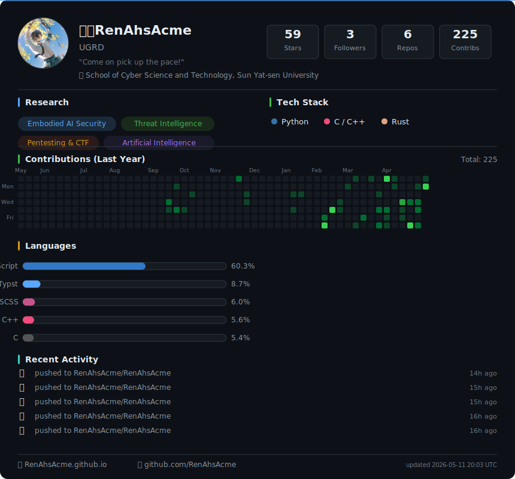

关于“刃律RenAhsAcme”

正如你的猜想，这不是名字，我对它的定义是“代号”。始于中学时代早期，于高中一年级正式确立为“行动代号”。这是中二病时期的我给出的产物。

谁还没有幼稚的时光呢？但我不愿承认那叫做幼稚。正如一个人如果连自己都会否定的话，又从何处寻求认可呢？我的人生规则之一就是从不否定自己，而是带着旧日的自己，迈向更好的明天。

这个代号也承载着我对我自己、这个世界，属于中二病时期的看法，那是秘密。我能告诉你的是，它依旧正确，恰当，正直。因此我没有换掉它的理由。

**关于如何称呼我**

我不介意你用任何方式称呼我。真名、代号以及它们的衍生昵称均可。请勿在匿名社区使用我的真名，同样地，请勿在正式严肃场合使用我的代号。

**关于“阿刃”称呼的ky说明**

一些病友称我为“阿刃”。容我重申，“刃律”的行动代号早在2020年前期就已形成。当下游戏《崩坏：星穹铁道》（首次亮相于2021年）中星核猎手阵营的角色“刃”（首次UP于2023年）被星核猎手自家人亲切称为“阿刃”。这是我始料未及的，以至后来有病友这么称呼我的时候，我有一种气急败坏的感觉。如果你介意，请不要这样称呼我，该代号与角色“刃”毫无关系。

**关于“刃律”的英文翻译RenAhsAcme**

该翻译仍然是中二病的产物，并未严格按照原意及衍生含义翻译。

- “Ren”：“刃”的音译，当时我认为此字甚好，所以不予翻译；

- “Ahs”：一种类似于中间名的代号，具体含义是秘密；

- “Acme”：对“律”字的衍生义的翻译。

当你需要使用英文代号称呼我时：

- 你可以使用简易缩写“RAA”；

- 当需要读出来时，请直接称呼对“Acme”的另外称呼“Ace”；

- 或者，直接@我的ID。

Profile in English

表态

该约束适用于我的所有仓库，以表达我的态度。当其中的条款与仓库中适用的协议条款冲突时，以仓库的条款为准。

该条款不具备中国大陆及国际通行或认可的法律效力，请留意相关法律风险。

版权所有（c）2026 刃律 RenAhsAcme

反996许可证版本1.0

在符合下列条件的情况下，特此免费向任何得到本授权作品的副本（包括源代码、文件和/或相关内容，以
下统称为“授权作品”）的个人和法人实体授权：被授权个人或法人实体有权以任何目的处置授权作品，包括
但不限于使用、复制，修改，衍生利用、散布，发布和再许可：

1. 个人或法人实体必须在许可作品的每个再散布或衍生副本上包含以上版权声明和本许可证，不得自行修
改。
2. 个人或法人实体必须严格遵守与个人实际所在地或个人出生地或归化地、或法人实体注册地或经营地（
以较严格者为准）的司法管辖区所有适用的与劳动和就业相关法律、法规、规则和标准。如果该司法管辖区
没有此类法律、法规、规章和标准或其法律、法规、规章和标准不可执行，则个人或法人实体必须遵守国际
劳工标准的核心公约。
3. 个人或法人不得以任何方式诱导、暗示或强迫其全职或兼职员工或其独立承包人以口头或书面形式同意
直接或间接限制、削弱或放弃其所拥有的，受相关与劳动和就业有关的法律、法规、规则和标准保护的权利
或补救措施，无论该等书面或口头协议是否被该司法管辖区的法律所承认，该等个人或法人实体也不得以任
何方法限制其雇员或独立承包人向版权持有人或监督许可证合规情况的有关当局报告或投诉上述违反许可证
的行为的权利。

该授权作品是"按原样"提供，不做任何明示或暗示的保证，包括但不限于对适销性、特定用途适用性和非侵
权性的保证。在任何情况下，无论是在合同诉讼、侵权诉讼或其他诉讼中，版权持有人均不承担因本软件或
本软件的使用或其他交易而产生、引起或与之相关的任何索赔、损害或其他责任。

